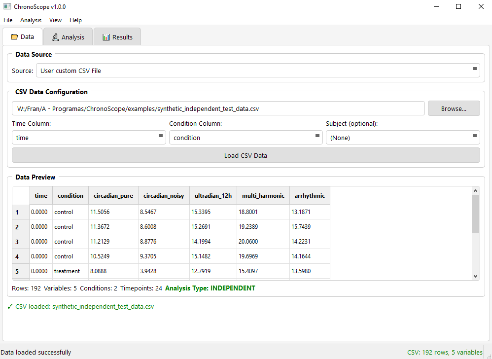
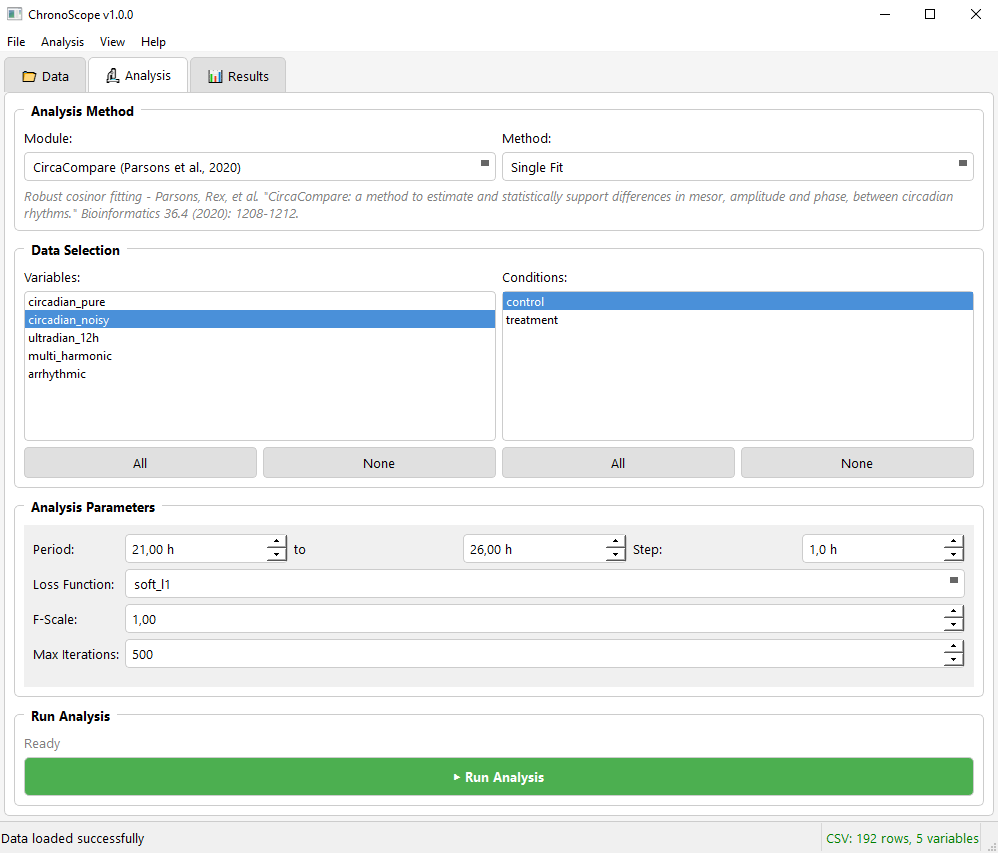
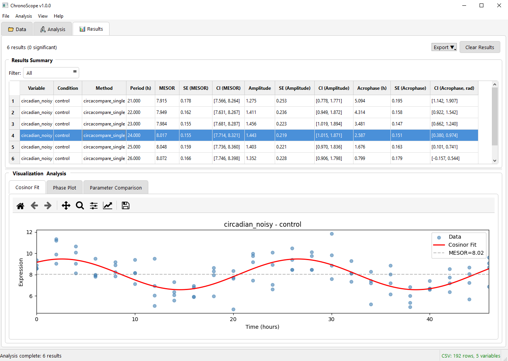

# ChronoScope

<p align="center">
  <strong>A Desktop Application for Multi-Method Circadian Rhythm Analysis</strong>
</p>

<p align="center">
  
  
  
  
</p>

<p align="center">
  <a href="#overview">Overview</a> •
  <a href="#key-features">Features</a> •
  <a href="#download">Download</a> •
  <a href="#installation-from-source">Installation</a> •
  <a href="#usage">Usage</a> •
  <a href="#data-preprocessing-optional">Preprocessing</a> •
  <a href="#analysis-modules">Modules</a> •
  <a href="#citation">Citation</a>
</p>

<p align="center">
  
  
  
</p>
<p align="center"><sub><em>Load data → configure & run an analysis → export publication-ready results.</em></sub></p>

---

## Overview

Choosing among the growing number of rhythm-detection methods — each with different assumptions and failure modes — is one of the biggest hurdles in circadian data analysis. ChronoScope solves this with a single cross-platform desktop app that bundles **seven established rhythm-detection algorithms** plus a novel ML consensus score (**CRS-AI**) behind a point-and-click interface, so no programming is required.

It's built for circadian biologists working with gene expression, protein abundance, locomotor activity, count data, or any uniformly sampled time series — with native support for CSV files, Drosophila activity monitors (DAM/TriKinetics), rodent wheel-running data (AWD/ClockLab), and the Rosbash circadian neuron scRNA-seq dataset.

## Key Features

- **No coding required** — point-and-click interface built with PySide6 (Qt)
- **Six integrated analysis modules** — CosinorPy, CircaCompare, RhythmCount, Rhythm Analysis Suite, CRS-AI, and Locomotor Activity Analysis
- **Count-data support** — GLM-based cosinor fitting with five count distributions (Poisson, NB, ZIP, ZINB, Generalized Poisson)
- **Differential rhythmicity** — statistical comparison of cosinor parameters between conditions
- **CRS-AI** — Random Forest consensus score integrating outputs from multiple methods
- **Locomotor activity support** — native parsing of TriKinetics (DAM) and Actimetrics ClockLab (AWD) files, with dedicated actogram, chi-square periodogram, and activity-rhythm metrics
- **Optional preprocessing pipeline** — outlier removal, detrending, and smoothing filters, applied before any analysis
- **scRNA-seq support** — integrated loader for the Rosbash *Drosophila* clock neuron dataset
- **Publication-ready output** — PNG, SVG, PDF figures; CSV and Excel result tables

---

## Download

The easiest way to get started — no Python, no dependencies.

**[⬇ Download the latest release](https://github.com/FranTassara/ChronoScope/releases/latest)**

| Platform | What to grab | Run |
|---|---|---|
| Windows | `ChronoScope-win64.zip` | Unzip anywhere, then run `ChronoScope.exe` |
| macOS | `ChronoScope-macos.zip` | Unzip, then open `ChronoScope.app` |

> **macOS Gatekeeper note:** the app isn't notarized by Apple yet, so the first launch may be blocked. Right-click the app → **Open**, or run `xattr -cr ChronoScope.app` in Terminal, then open it normally.

Prefer to run from source, or on Linux? See [Installation from source](#installation-from-source) below.

---

## Installation from source

### Requirements

- Python 3.9 or higher
- See `requirements.txt` for the complete dependency list

### Steps

```bash
# Clone the repository
git clone https://github.com/FranTassara/ChronoScope.git
cd ChronoScope

# Create a virtual environment (recommended)
python -m venv venv
source venv/bin/activate       # Linux / macOS
venv\Scripts\activate          # Windows

# Install dependencies
pip install -r requirements.txt

# Launch the application
python main.py
```

> **Note:** ChronoScope patches deprecated NumPy type aliases at startup to maintain compatibility with CosinorPy on NumPy ≥ 2.0.

---

## Usage

### Quick Start

1. **Load data** — click *Browse…* to select a CSV file, or choose *DAM Monitor* / *Rosbash scRNA-seq* from the dataset selector.
2. **Map columns** — assign time, condition, and variable columns. The application auto-detects common column names.
3. **Select a module** — CosinorPy, CircaCompare, Rhythm Analysis, or CRS-AI.
4. **Run analysis** — set parameters (period, number of harmonics, etc.) and click *Run Analysis*.
5. **Export results** — summary tables (CSV / Excel) and figures (PNG / SVG / PDF) via the *Export* panel.

<details>
<summary><strong>CSV format & optional data sources</strong></summary>

#### CSV Format

```
time,condition,replicate,gene1,gene2,gene3
0,control,1,10.2,5.3,8.1
0,control,2,10.5,5.1,8.3
4,control,1,12.1,6.2,9.2
4,control,2,11.8,6.4,9.0
...
```

**Required columns:**
- `time` — numeric time in hours
- `condition` — group or treatment label
- One or more numeric variable columns

**Optional columns:**
- `replicate` — replicate identifier
- `subject` — subject/animal ID (required for population-mean cosinor)

#### Locomotor Activity Files (DAM / AWD)

Load raw TriKinetics `.txt` DAM monitor files (*Drosophila* beam-break activity) or Actimetrics ClockLab `.awd` files (rodent wheel-running activity) directly. ChronoScope parses each format, bins/structures the data for downstream analysis, and unlocks the [Locomotor Activity Analysis module](#6-locomotor-activity-analysis-module) (actogram, chi-square periodogram, IS/IV, α/ρ, onset/offset).

#### Rosbash scRNA-seq Dataset

Preprocessed HDF5 file derived from:

> Ma D, Przybylski D, Bhinder T, et al. A transcriptomic taxonomy of *Drosophila* circadian neurons around the clock. *eLife* 2021;10:e63056.

Use the included `Rosbash_data/process_rosbash_dataset.py` script to generate the HDF5 file from the raw GEO data.

</details>

---

## Data Preprocessing (optional)

Before running any analysis module, each variable can be passed through an optional filter pipeline (`core/preprocessing.py`). Every stage is disabled by default and configured independently; when enabled, they always run in this order:

| Stage | Methods | Purpose |
|---|---|---|
| 1. Outlier removal | IQR · Z-score | Flags anomalous points and replaces them with NaN before fitting |
| 2. Detrending | Linear · Moving average · Polynomial | Removes slow, non-rhythmic trends while preserving the circadian oscillation |
| 3. Smoothing | Moving average · Savitzky–Golay · Butterworth (low-pass) | Reduces high-frequency noise |

This is useful for noisy locomotor activity traces or gene expression series with batch drift, before feeding the data into CosinorPy, RhythmCount, or the Rhythm Analysis Suite.

---

## Analysis Modules

### 1. CosinorPy Module

Wraps the CosinorPy library (Moškon 2020) with a graphical interface for:

| Analysis | Description |
|---|---|
| Single-component cosinor | Fits M + A·cos(2πt/τ − φ) to a single group |
| Multi-component cosinor | Up to 6 harmonics for non-sinusoidal waveforms |
| Population-mean cosinor | Longitudinal/repeated-measures designs |
| Differential rhythmicity | Tests MESOR, amplitude, and acrophase differences between two groups |
| Poisson cosinor | Cosinor extension for count data (sequencing read counts) |

### 2. CircaCompare Module

Implements the CircaCompare framework (Parsons et al. 2020) for robust comparison of rhythm parameters between conditions. Supports five loss functions for outlier-resilient fitting:

`linear` · `soft_l1` · `huber` · `cauchy` · `arctan`

Outputs confidence intervals for MESOR, amplitude, and acrophase differences.

### 3. RhythmCount Module

Wraps the RhythmCount library (Velikajne et al. 2022) to fit cosinor models within a generalized linear model (GLM) framework for **count-valued time series** — RNA-seq read counts, neuronal spike counts, locomotor activity event tallies, or any non-negative discrete data where the Gaussian residual assumption of standard cosinor is violated.

Five count distributions are supported:

| Distribution | When to use |
|---|---|
| Poisson | Equidispersed counts (variance ≈ mean) |
| Generalized Poisson | Flexible dispersion (sub- or over-dispersed) |
| Negative Binomial | Over-dispersed counts (variance > mean); typical in RNA-seq |
| Zero-Inflated Poisson | Excess structural zeros + Poisson counts |
| Zero-Inflated Negative Binomial | Excess structural zeros + overdispersion |

**Five analysis methods** are available:

| Method | Description |
|---|---|
| Fit Single Model | Fits a user-specified distribution and harmonic complexity |
| Fit All Models | Grid search over all distribution × harmonic combinations |
| Fit Best Model | Automatic two-stage model selection (AIC / BIC / Vuong / F-test) |
| Parameter CIs | Bootstrap confidence intervals for amplitude, MESOR, and acrophase |
| Group Comparison | Independent best-model selection and CI estimation per group |

Goodness of fit is assessed via the likelihood ratio test (LLR p-value), AIC, BIC, and McFadden's pseudo-R². Amplitude, MESOR, and acrophase are extracted from the predicted curve after fitting.

### 4. Rhythm Analysis Suite

Seven algorithms available for period detection and rhythmicity testing:

| Method | Type | Best suited for |
|---|---|---|
| JTK Cycle | Nonparametric | Genome-scale datasets; no waveform assumption |
| AR-JTK | Nonparametric | Autoregressive-corrected JTK for autocorrelated data |
| Lomb–Scargle | Spectral | Unevenly sampled or missing time points |
| Wavelet (CWT) | Time–frequency | Non-stationary rhythms; temporal changes in amplitude |
| Fourier F24 | Effect size | Quantifying 24 h power relative to total variance |
| Harmonic cosinor | Parametric | Multi-modal waveforms (up to 4 harmonics) |
| Linear mixed effects | Hierarchical | Nested or longitudinal designs |

### 5. CRS-AI (Consensus Rhythmicity Score)

A Random Forest classifier trained on synthetic and real circadian time series that aggregates feature vectors extracted from JTK Cycle, single-component cosinor, and Lomb–Scargle into a single probability score (0–1). CRS-AI provides an integrated assessment that is more robust than any individual method alone, particularly for short or noisy time series.

The model was trained on synthetic oscillations spanning a range of amplitudes, noise levels, and sampling densities, and validated on two public datasets: GSE11923 (mouse liver, hourly × 48 h) and the Rosbash *Drosophila* circadian neuron scRNA-seq dataset.

### 6. Locomotor Activity Analysis Module

Automatically enabled when the loaded dataset is a DAM (TriKinetics, *Drosophila*) or AWD (Actimetrics ClockLab, rodent) recording. Runs a full activity-rhythm characterization ("Activity Profile") in one pass:

| Output | Description |
|---|---|
| Double-plotted actogram | Population mean or individual (median-τ) actogram |
| Chi-square periodogram | Per-individual period (τ) estimation with a rhythmicity significance filter |
| Interdaily stability (IS) / Intradaily variability (IV) | Regularity of the rhythm across days vs. fragmentation within a day |
| α / ρ | Active-phase vs. rest-phase activity ratio |
| Onset / offset | Activity onset and offset timing per cycle |

---

<details>
<summary><h2 style="display:inline">Methods reference (formulas & algorithm details)</h2></summary>

### Cosinor Model

$$Y(t) = M + A \cos\!\left(\frac{2\pi t}{\tau} - \varphi\right) + \varepsilon$$

| Symbol | Parameter | Description |
|--------|-----------|-------------|
| M | MESOR | Rhythm-adjusted mean (Midline Estimating Statistic Of Rhythm) |
| A | Amplitude | Half the peak-to-trough difference |
| φ | Acrophase | Time of peak in radians; converted to hours for output |
| τ | Period | Fixed (default 24 h) or estimated |
| ε | Residual | Assumed i.i.d. Gaussian |

Statistical significance is assessed via the zero-amplitude test (F-test on A = 0).

### RhythmCount GLM

$$\log(\mu_i) = \beta_0 + \sum_{k=1}^{N} \left[ \beta_{2k-1} \sin\!\left(\frac{2\pi k t_i}{\tau}\right) + \beta_{2k} \cos\!\left(\frac{2\pi k t_i}{\tau}\right) \right]$$

### JTK Cycle

A nonparametric procedure that:
1. Ranks the time series and computes Kendall's τ against a reference waveform template for each candidate period
2. Corrects for multiple period tests using the Bonferroni–Dunn method
3. Returns estimated period, phase, and amplitude without assuming a sinusoidal shape

### Lomb–Scargle Periodogram

Evaluates spectral power at each candidate frequency using a least-squares projection, making it valid for unevenly sampled or gapped time series. Period is estimated at the frequency with maximum power; a *p*-value is derived from the false alarm probability.

### CRS-AI Feature Vector

For each time series, ChronoScope extracts 18 features from JTK Cycle, cosinor, and Lomb–Scargle (p-values, effect sizes, estimated periods, R², method agreement index, and relative amplitude). A pre-trained Random Forest classifier (100 trees, trained on ≥ 10 000 synthetic instances) maps this feature vector to a rhythmicity probability score.

### Output Parameters

| Parameter | Description | Units |
|-----------|-------------|-------|
| MESOR | Rhythm-adjusted mean | Same as input |
| Amplitude | Half peak-to-trough difference | Same as input |
| Acrophase | Time of peak | Hours |
| Period | Oscillation period | Hours |
| p-value | Test of zero amplitude (or equivalent) | — |
| R² | Goodness of fit | 0–1 |
| CRS score | Consensus rhythmicity probability | 0–1 |

</details>

---

## Citation

If you use ChronoScope in your research, please cite:

```bibtex
@article{tassara2025chronoscope,
  author  = {Tassara, Francisco},
  title   = {ChronoScope: A Desktop Application for Multi-Method Circadian Rhythm Analysis},
  journal = {Journal of Biological Rhythms},
  year    = {2025},
  doi     = {TODO}
}
```

<details>
<summary>Please also cite the underlying methods used in your analysis</summary>

**CosinorPy:**
> Moškon M. (2020). CosinorPy: a Python package for cosinor-based rhythmometry.
> *Source Code for Biology and Medicine*, 15(1), 1–10.

**CircaCompare:**
> Parsons R, et al. (2020). CircaCompare: a method to estimate and statistically support
> differences in mesor, amplitude and phase, between circadian rhythms.
> *Bioinformatics*, 36(4), 1208–1212.

**RhythmCount:**
> Velikajne N, et al. (2022). RhythmCount: an R/Python package for circadian
> rhythmicity analysis of count data. DOI: to be confirmed upon publication.

**JTK_CYCLE:**
> Hughes ME, et al. (2010). JTK_CYCLE: an efficient nonparametric algorithm for
> detecting rhythmic components in genome-scale datasets.
> *Journal of Biological Rhythms*, 25(5), 372–380.

</details>

---

## License

MIT License — see [LICENSE](LICENSE) for details.

## Dependencies

| Package | Version | Purpose |
|---------|---------|---------|
| PySide6 | ≥ 6.5 | GUI framework |
| NumPy | ≥ 1.24 | Numerical computation |
| pandas | ≥ 1.5 | Data handling |
| SciPy | ≥ 1.10 | Statistical tests, Lomb–Scargle |
| matplotlib | ≥ 3.7 | Visualizations |
| scikit-learn | ≥ 1.2 | CRS-AI Random Forest |
| CosinorPy | ≥ 1.1 | Cosinor rhythmometry |

---

<p align="center">
  Developed for the circadian biology community · Francisco Tassara
</p>
